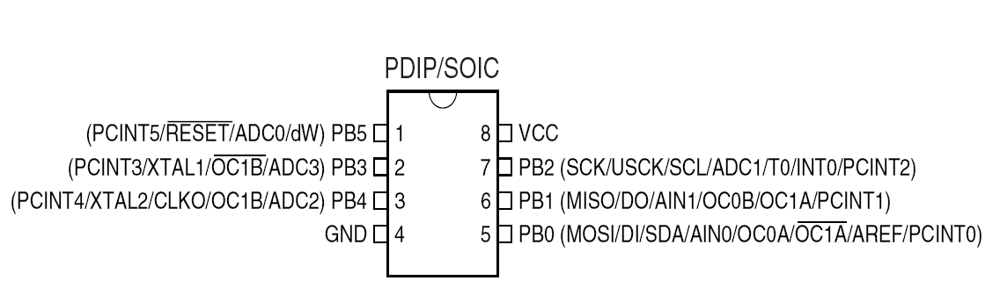
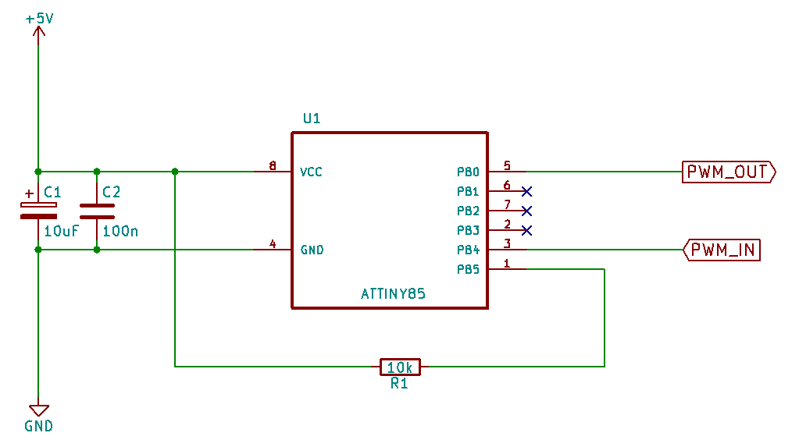

# PWM-Frequency Booster
### Convert low pwm frequency of  ~980Hz up to 32Khz
***
If it's necessary to have higher frequency on puls width modulation than a standard MCU is able to and its not practicable to increase the controller timer frequency, you can use this solution.
If your fan works like a speaker, you know what I mean :smirk:

An ATTiny85 or similar MCU, convert the low pwm-frequency of **976.5625Hz** (e.g. a standard Arduino pwm frequency) up to
**32KHz**. You need only a cheap ATTiny model, this program and a 10k resistor. The duty cycle of the puls is not touched, that means:
````
Input Duty Cycle = Output Duty Cycle
````
#### In this example an ATTiny85 is used. <p align="left"></p>

---
Schematics:

<p align="left"></p>

>- The low pwm input is on pin3 (PB4), the high pwm output on pin5 (PB0)
>- On pin1 a 10k resistor is connected direct to VCC
>- The two caps are standard blocking capacitors
  
---
Software:

In the header section you can find some values to adjust the program according to your situation:
```c
#define PWM_INPUT      // PWM low frequency input pin
#define PWM_OUTPUT     // PWM high frequency output pin
#define PWM_FREQ_HIGH  // PWM frequency: 0 = 16KHz or 1 = 32KHz
#define DUTY_MIN_LIMIT // min limit according your fan 
#define DUTY_MAX_LIMIT // max limit according your fan
```

To get more or less precise values you can adjust the SAMPLE_RATE. More accuracy needs more time, try with some values to find the best for your project. A good guide value is times of 256, 512 or 1024.
```c
// some examples:
#define SAMPLE_RATE 512  // verry fast reaction
#define SAMPLE_RATE 1024 // fast reaction, but a smaller accuracy
#define SAMPLE_RATE 1280 // little bit slower reaction, but better accuracy
#define SAMPLE_RATE 1536 // good agreement of speed and precision
#define SAMPLE_RATE 1792 // slower reaction of pwm changes, but high accuracy
```
If you try out some diffent values of **SAMPLE_RATE**, its a good idea to deliberate about **SAMPLE_TIME**. This time is in dependence of the rate. Higher sample rate needs more time to calculate the duty cycle, so the sample time should also grow and vice versa.

Programmer:

One hint to program the MCU: Its important to erase the **Fuse Low Byte CKDIV8** of the MCU to get 8MHz Clock frequency!
